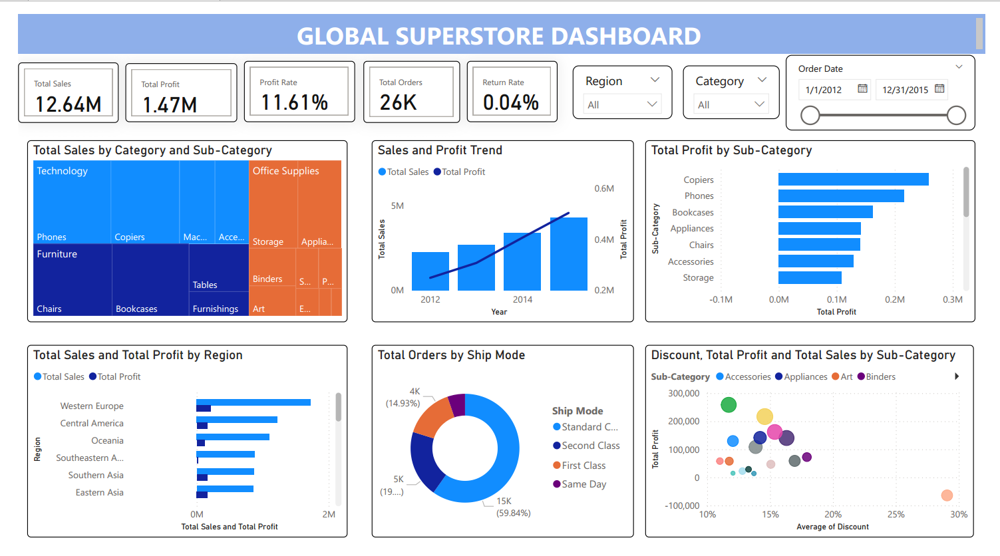
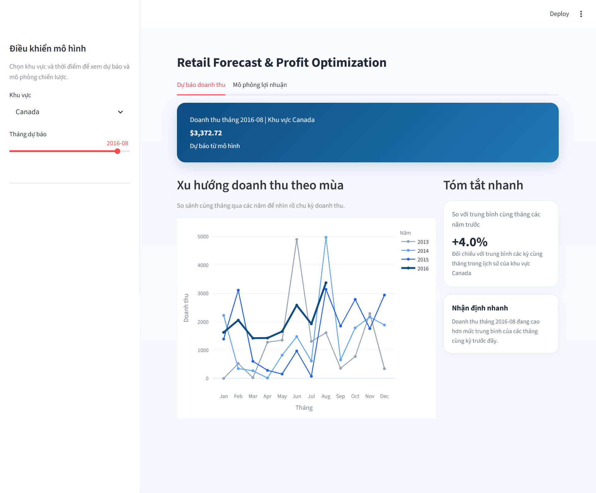
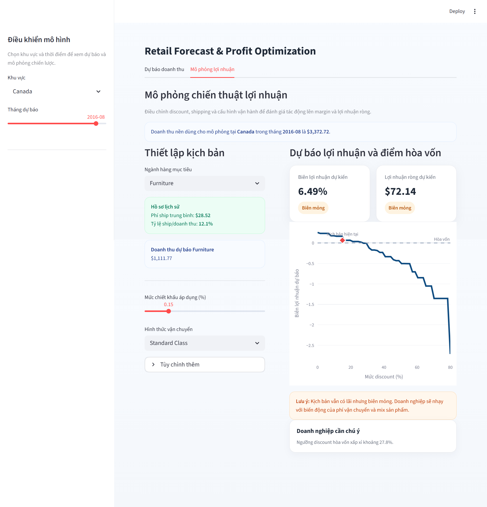

# Global Superstore Sales Forecasting & Analytics

## Project Overview
This project focuses on analyzing historical sales data from the Global Superstore dataset. The goal is to build a high-accuracy machine learning model to forecast future sales and predict profit margins. 

---

## Tech Stack
* **Data Visualization:** Power BI Desktop
* **Programming Language:** Python 
* **Libraries:** Pandas, Numpy, XGBoost, Scikit-learn, Matplotlib, Seaborn
* **Version Control:** Git & GitHub

---

## Business Insights (Power BI)
Dưới đây là Dashboard phân tích tổng quan tình hình kinh doanh:

*Hình 1: Tổng quan phân tích doanh số trên Power BI*

---

## Machine Learning Approach

### 1. Sales Forecasting

*Hình 2: Kết quả dự báo doanh thu hàng tháng*

### 2. Profit Analysis

*Hình 3: Mô phỏng biến động lợi nhuận theo Discount*

---

## Model Evaluation
* **WAPE:** Giảm từ **34.89%** xuống còn **31.45%**.
* **R² Score:** **0.6070**.

 ## How to Use
Follow these steps to set up and run the project on your local machine.

### 1. Prerequisites
Ensure you have Python 3.8+ and Git installed on your system.

### 2. Installation
Clone the repository to your local machine:

Bash
git clone https://github.com/TranggVu/TranggVu_GlobalSuperStore.git
cd TranggVu_GlobalSuperStore
Install the required dependencies:

Bash
pip install -r requirements.txt
### 3. Data Setup
The project expects the dataset to be placed in a data/ folder within the root directory.
### 4. Running the Project
Open the project in your preferred IDE (e.g., Jupyter Notebook, VS Code, or JupyterLab).

Open Global_Superstore.ipynb.

Run the cells sequentially to execute the data analysis and forecasting models.

This guide is clear, follows the structure you’ve built, and tells users exactly what they need to do. Good luck with your project!
